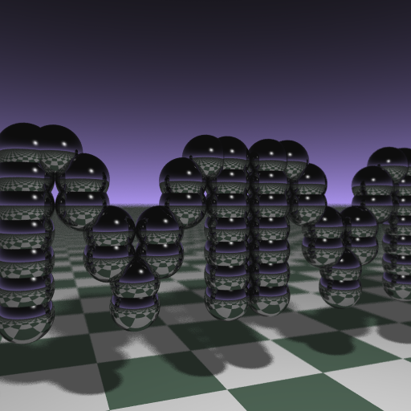

# BusinessCardRayTracer

## About

The Business Card Ray Tracer is originally written by [Andrew Kensler](http://www.cs.utah.edu/~aek/code/card.cpp) and reverse engineered by [Fabien Sanglard](http://fabiensanglard.net/rayTracing_back_of_business_card/). I modified the code to include my own initials `MM` instead of `aek` (Andrew Kensler) or `Fab` (Fabien Sanglard), and changed the red tile color to a green tile color. This unfortunately does not result in an ["elite"](https://nl.wikipedia.org/wiki/Leet) size of 1337 characters, but rather 1360 or 1350 (if you use a basic green color).

<p align="center"></p>

## Initial Generation

1. Create the 9x 19-bit Big-endian binary masks representing the initials. (The current camera settings maximally support a 9x19 regular grid of spheres.
2. Convert the 9x 19-bit Big-endian binary masks to a decimal format.
```
                    =                                                   = 0
                    =                                                   = 0
11     11 11     11 = 2^18 + 2^17 + 2^11 + 2^10 + 2^8 + 2^7 + 2^1 + 2^0 = 396675
1 1   1 1 1 1   1 1 = 2^18 + 2^16 + 2^12 + 2^10 + 2^8 + 2^6 + 2^2 + 2^0 = 333125
1 1   1 1 1 1   1 1 = 2^18 + 2^16 + 2^12 + 2^10 + 2^8 + 2^6 + 2^2 + 2^0 = 333125
1  1 1  1 1  1 1  1 = 2^18 + 2^15 + 2^13 + 2^10 + 2^8 + 2^5 + 2^3 + 2^0 = 304425
1  1 1  1 1  1 1  1 = 2^18 + 2^15 + 2^13 + 2^10 + 2^8 + 2^5 + 2^3 + 2^0 = 304425
1   1   1 1   1   1 = 2^18 + 2^14 + 2^10 + 2^8 + 2^4 + 2^0              = 279825
1   1   1 1   1   1 = 2^18 + 2^14 + 2^10 + 2^8 + 2^4 + 2^0              = 279825
```

3. Add the decimal values in reverse order to the `G` array describing the world/scene.
```
i G[]={279825,279825,304425,304425,333125,333125,396675,0,0};
```

## Use
1. `rt.exe > mm.ppm`
